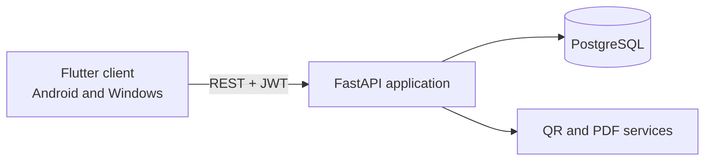

# School Inventory

[](https://github.com/Lisovtcoff-hub/school-inventory/actions/workflows/ci.yml)

A cross-platform asset management system for schools and other educational organizations. The project combines a FastAPI backend with an Android and Windows Flutter client.

The system tracks equipment throughout its lifecycle, generates QR labels, keeps an audit history and produces regulatory and operational PDF reports.

The repository is organized as a monorepo with independently testable backend and frontend applications.

## Highlights

- Organization activation through license codes
- JWT authentication and role-based access for administrators, editors and viewers
- Multi-tenant isolation by organization
- Equipment catalog with search, filters, pagination and soft deletion
- Automatically generated 16-digit asset identifiers
- Audit history for important field changes and manual notes
- QR codes for individual assets and printable QR label sheets
- Dashboard statistics across the complete inventory
- OO-2 section 2.1 calculation and PDF export
- Classroom passport report with validation warnings and PDF export
- PostgreSQL migrations with Alembic
- Automated backend and Flutter checks in GitHub Actions

## Architecture



The backend is organized into API routes, services and repositories. The Flutter application is grouped by product feature and communicates with the backend through one authenticated API client.

## Technology

- **Backend:** Python 3.12, FastAPI, SQLAlchemy 2, Alembic, Pydantic
- **Database:** PostgreSQL; SQLite is used for isolated tests
- **Client:** Flutter, Dart, Provider, GoRouter, Dio
- **Documents:** ReportLab, Pillow, qrcode
- **Infrastructure:** Docker Compose, GitHub Actions
- **Testing:** Pytest, FastAPI TestClient, Flutter Test

## Repository structure

```text
backend/      FastAPI application, migrations and API tests
frontend/     Flutter application and Dart tests
docs/         Architecture and security notes
scripts/      Reproducible Flutter platform bootstrap
compose.yaml  PostgreSQL and backend development stack
```

## Start the backend with Docker

```bash
cp .env.example .env
docker compose up --build
```

The API is available at:

- OpenAPI: `http://localhost:8000/docs`
- Health check: `http://localhost:8000/health`

Before using a production environment, replace `SECRET_KEY` and database credentials in `.env`.

## Create a development license

After the backend is running:

```bash
docker compose exec api python -m app.scripts.create_license
```

Use the printed code on the organization activation screen.

## Prepare and run the Flutter client

The repository keeps application source code under version control and generates standard Android and Windows runner files reproducibly:

```bash
python scripts/bootstrap_flutter.py
cd frontend
flutter pub get
flutter run -d windows
```

For Android Emulator, run with the emulator backend address:

```bash
flutter run -d android --dart-define=API_BASE_URL=http://10.0.2.2:8000/api/v1
```

For a physical device, replace the host with the computer's LAN address.

## Development checks

Backend:

```bash
cd backend
python -m venv .venv
source .venv/bin/activate
pip install -r requirements-dev.txt
alembic upgrade head
pytest
```

Flutter:

```bash
python scripts/bootstrap_flutter.py
cd frontend
flutter pub get
flutter analyze
flutter test
```

CI validates the Alembic migration chain against a clean PostgreSQL instance, executes backend API tests and runs Flutter analysis and tests.

## Security notes

- Passwords are stored as bcrypt hashes.
- JWT secrets and database credentials are loaded from environment variables.
- The application rejects placeholder secrets and non-PostgreSQL databases in production mode.
- Organization scope is derived from the authenticated user instead of request payloads.
- Viewer accounts cannot modify inventory.
- Local databases, environment files and generated platform artifacts are excluded from Git.

See [docs/architecture.md](docs/architecture.md) and [docs/security.md](docs/security.md) for implementation details.

## Project scope

This repository is a portfolio-safe version of an asset management product. It contains no school records, real license codes or deployment credentials. Regulatory reports are calculation aids and should be reviewed against the current official reporting requirements before submission.
